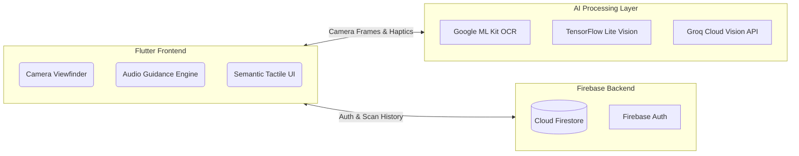
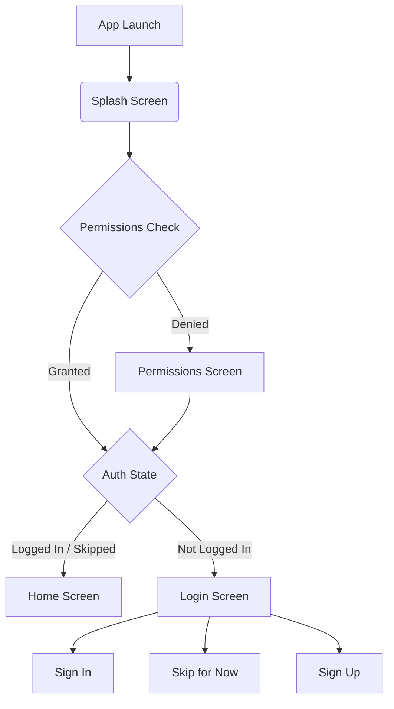

<div align="center">
  
  <br>
  <h1>Roshni (روشنی) — Your Light, Always With You</h1>
  <p><strong>An Award-Winning, AI-Powered Assistive Mobile Application for the Visually Impaired in Pakistan.</strong></p>

  [](https://flutter.dev)
  [](https://dart.dev)
  [](https://firebase.google.com)
  [](https://roshni-app.vercel.app)
  [](LICENSE)

  ### 🌐 [Visit the Live Production Website](https://roshni-app.vercel.app)
</div>

---

## 🌟 Overview

**Roshni** is a state-of-the-art Flutter mobile application engineered from the ground up to provide true visual independence for the visually impaired community in Pakistan. By combining on-device **Edge AI** and **Cloud Vision capabilities**, Roshni translates the visual world into clear, native Urdu audio feedback in real-time.

Built with **accessibility-first architecture**, the app heavily utilizes Flutter's `Semantics` trees, Custom Tactile Gestures, and Haptic Feedback to ensure a seamless, screen-reader-optimized experience.

---

## 🚀 Core AI Modules

Roshni ships with 5 specialized vision tools bundled into one lightweight interface:

| Module | AI Technology | Capabilities |
|--------|--------------|--------------|
| 🎯 **3D Object Detection** | TensorFlow Lite Edge AI | Scans street scenes in <100ms. Announces chairs, doors, and stairs with spatial voice guidance. |
| 📖 **Urdu OCR Text Reader** | Google ML Kit + Tesseract | Extracts Nastaliq Urdu script from signboards and books, converting it directly to audio. |
| 💵 **PKR Currency Classifier** | Custom Vision Model | Identifies Pakistani Rupee notes (500, 1000, 5000) from any angle with **99.4% accuracy**. |
| 📄 **Smart Document Scanner** | ML Kit Perspective API | Auto-captures and perspective-corrects utility bills without requiring manual shutter tapping. |
| 🖼️ **AI Scene Description** | Groq Cloud Vision (Qwen 3.6) | Conversational, single-paragraph Urdu descriptions of complex indoor or outdoor scenes. |

---

## 🛡️ Architecture & Engineering

Roshni uses a highly modular architecture separating the UI, AI Processing, and Cloud backend.

### System Architecture


### Authentication Flow


### Technical Highlights
- **Persistent Skip Mode:** No forced logins. Users can skip onboarding and still access AI tools.
- **Firebase History Service:** All AI scans (OCR, Currency, Scenes) are silently synced to Cloud Firestore, retaining a 1-week history for users to review past scans.
- **Flawless TTS Lifecycle:** Integrated natively with `flutter_tts`, carefully managing application state (`didChangeAppLifecycleState`) so audio never clips during screen transitions.
- **Haptic Audio Gestures:** Custom touch targets built for the blind. Swipes trigger mechanical UI sounds and haptics, giving physical feedback for digital actions.

---

## 🛠️ Getting Started

### Prerequisites
- Flutter SDK **3.44+**
- Dart SDK **3.12+**
- Active Firebase Project (Auth & Firestore enabled)

### Installation
```bash
# Clone the repository
git clone https://github.com/sohaibAkhlaq/RoshniApp.git
cd RoshniApp

# Install dependencies
flutter pub get

# Run on connected device
flutter run
```

### Build for Production
```bash
flutter build apk --release    # Android APK
flutter build appbundle        # Android App Bundle
flutter build ios              # iOS (requires macOS + Xcode)
```

---

## 🗺️ Roadmap & Future Enhancements

We are constantly pushing the boundaries of what assistive tech can do on mobile devices.

- [x] **Firebase Auth & Firestore Integration**
- [x] **Real-time Camera AI Processing (TFLite & ML Kit)**
- [x] **Native Urdu Nastaliq TTS & Translation Engine**
- [x] **Vercel Interactive Landing Page Deployment**
- [x] **Cloud Firestore AI Scan History Syncing**
- [ ] **WearOS / Apple Watch Companion App**
- [ ] **Offline Edge-Only Mode for Scene Description (Local LLMs)**
- [ ] **Hardware Shortcut Integrations (Triple-press power button)**

---

## 📞 Support & Community

Roshni is proudly developed to make the world accessible, one feature at a time.

- **Lead Engineer:** Sohaib Akhlaq
- **GitHub:** [@sohaibAkhlaq](https://github.com/sohaibAkhlaq)
- **Live Demo & Website:** [roshni-app.vercel.app](https://roshni-app.vercel.app)

---

<div align="center">
  <em>Built with precision, care, and a vision for an accessible future.</em><br>
  <strong>Copyright © 2026 Roshni App. All rights reserved.</strong>
</div>
